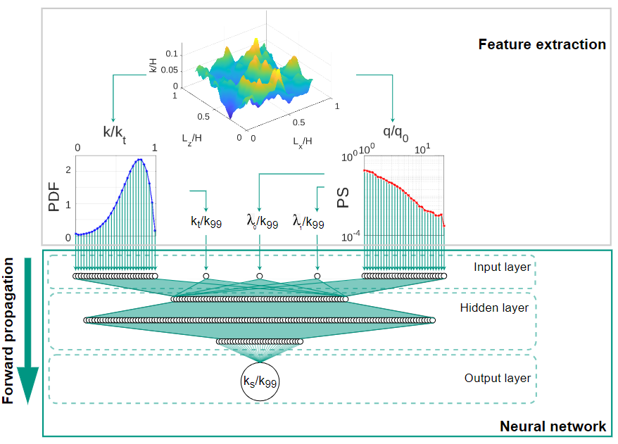

<a name="readme-top"></a>

# Active-learning-codes
This repository is associated with the research article authored by J. Yang, A. Stroh, S. Lee, S. Bagheri, B. Frohnapfel, and P. Forooghi, titled "Prediction of Equivalent Sand-Grain Size and Identification of Drag-Relevant Scales of Roughness - A Data-Driven Approach," which was published in the *Journal of Fluid Mechanics* 2023.


[](https://arxiv.org/abs/2304.08958)

<!-- TABLE OF CONTENTS -->
<details>
  <summary>Table of Contents</summary>
  <ol>
    <li>
      <a href="#about-the-project">About The Project</a>
    </li>
    <li>
      <a href="#getting-started">Getting Started</a>
    </li>
    <li><a href="#Folders">Folders</a></li>
    <li><a href="#usage">Usage</a></li>
    <li><a href="#citation">Citation</a></li>
    <li><a href="#contact">Contact</a></li>
    <li><a href="#license">License</a></li>
  </ol>
</details>

<!-- ABOUT THE PROJECT -->
## About The Project

The current project encompasses a collection of Python scripts, spanning tasks such as analyzing roughness statistics, performing Bayesian optimization for neural network architecture, and conducting ensemble neural network training using predefined architectures.


<p align="right">(<a href="#readme-top">back to top</a>)</p>


### Built With

  &nbsp; &nbsp; v 3.8

<p align="right">(<a href="#readme-top">back to top</a>)</p>


<!-- GETTING STARTED -->

## Getting Started
The present repository contains jupyter notbooks scripts.

### Prerequisites

Python 3.8 along with following Python packages are required for running the code

* Numpy
  ```bash
    pip3 install numpy==1.21.5
  ```
* Scipy
  ```bash
    pip3 install scipy==1.7.3
  ```

* Pandas
  ```bash
    pip3 install pandas==1.4.1
  ```

* Matplotlib
  ```bash
    pip3 install matplotlib==3.6.2
  ```

* TensorFlow
  ```bash
    pip3 install tensorflow==2.10.0
  ```

* scikit-learn
  ```bash
    pip3 install -U scikit-learn==1.0.2
  ```
* scikit-optimize
  ```bash
    pip3 install scikit-optimize==0.9.0
  ```

<p align="right">(<a href="#readme-top">back to top</a>)</p>

### Installation

Clone the repository
   ```sh
   git clone https://github.com/JiashengY/Active-learning-codes.git
  ```

<p align="right">(<a href="#readme-top">back to top</a>)</p>

<!-- Folders -->
## Folders

* #### rgh_class 
This folder contains roughness class **rgh**, **rgh** is a Python class that provides a convenient and efficient way to perform a variety of operations related to roughness analysis.
* #### Bayesian_optimization
This folder contains BO routine **NeuralNetwork_BO.ipynb** for optimizing NN archeticture for the current task setup. Output file <strong>Hyperparameters_BO.csv</strong>
* #### enn_training
This folder contains ENN training script **NeuralNetwork_train.ipynb** based on  user specified NN architecture documented in <strong>Hyperparameters.csv</strong>, either generated from BO process or user-defined. The trained ENN model members are stored in the folder **Models** at the same location.


<!-- USAGE EXAMPLES -->
## Usage
### rgh Python class
**rgh** is a Python class that provides a convenient and efficient way to perform a variety of operations related to roughness analysis.
You can move the rgh_class.py file from this repository and place it in your project directory. Import **rgh** class:
```python 
import rgh_class as rgh
```
Create an instance of the rgh class:
```python 
surface=rgh.rgh(x,z,y) # x,z are streamwise, spanwise coordinates, y is 2-D roughness map
```
### Attributes
The **rgh** class calculates following attributes automatically once the instance is assigned:
* **Lx**, **Lz** : Streamwise and spanwise extents of the roughness patch, respectively.
* **kt** : Peak-to-trough height of the roughness
* **k99** : 99% confidence interval of roughness PDF
* **sk** : Skewness of the roughness PDF ${1\over Sk_{rms}^3}\int_S(k-k_{md})^3\text{d}S$, where $S$ is the projected area.
* **ku** : Kurtosis of the roughness PDF with Pearson's definition ${1\over Sk_{rms}^4}\int_S(k-k_{md})^4\text{d}S$
* **krms** : Standard diviation of roughness height $\sqrt{{1\over S}\int_{S}(k-k_{md})^2\text{d}S}$
* **kmd** : Melt-down height of roughness, measuring bottom ${1\over S} \int_{S}k\text{d}A$
* **ra** : Mean absolute diviation of roughness height around the mean plane ${1\over S}\int_{S}|k-k_{md}|\text{d}S$
* **por** : Porosity of the roughness within the roughness region
* **ESx** **ESz** : Effective slope in streamwise and spanwise directions, respectively ${1\over S}\int_{S}|{\partial k \over \partial x,z}|\text{d}S$
* **incx** **incz** : Inclination of roughness in streamwise and spanwise directions, respectively $\text{tan}^{-1}({1\over 2}Sk({\partial k \over \partial x,z}))$
### Methods
The **rgh** class provides the following methods:
* **print_stat()** : Generate a table containing roughness statistical parameters
* **show_surface(representation="2D")** : Plot surface geometry.
  * **representation** : String, showing the representation of roughness geometry either in "2D" or "3D".
* **plot_PDF(n_bins=10,normalization=True)** : Present roughness height PDF, where:
  * **n_bins**: integer, number of bins. 
  * **normalization** : boolean, if the plot is noramalized to density.
* **plot_PS(normalization=True,circular_average=False,moving_average=False)**: Present roughness height PS, where:
  * **normalization** : boolean, if the PS is noramalized with root-mean-square roughness height. 
  * **azimuthal_average=False**: azimuthally averaged PS around origin of spectral space i.e. (qx,qz)=(0,0), to acquire 1-d PS. 
  * **moving_average=False**: Once azimuthal average is done, moving average over 1-d PS can be carried out on demand. 
  * **n_iter**: number of moving averaging iterations.
* **FFT_filter(lmax,lmin)**: Spectral filtering of the surface, **lmax**, **lmin** are the desired largest and smallest roughness wavelengths, respectively.
* **get_model_input(lmax=2,lmin=0.04,azimuthal_average=False,moving_average=False,n_iter=3,do_plots=False)**: Generate input vector for the ML model proposed in the publication, where:
  * **lmax**: largest incorporated wavelength
  * **lmin**: smallest incorporated wavelength
  * **azimuthal_average=False**: azimuthally averaged PS around origin of spectral space i.e. (qx,qz)=(0,0), to acquire 1-d PS. 
  * **moving_average=False**: once azimuthal average is done, moving average over 1-d PS can be carried out on demand. 
  * **n_iter**: number of moving averaging iterations.
  * **do_plots**: plotting PDF and PS inputs with red markers.
### Roughness prediction
**predict(surface_input,n_models=50,n_p=4)** is the function to predict given inputs with the ensemble neural network. The prediction process is parallelized on **n_p** CPUs.
* **surface_input** is the input vector for the current model, this can be obtained by **get_model_input** method in **rgh** class. For instance:

```python
import multiprocessing as mp
prediction=rgh.predict(surface.get_model_input(),n_p=mp.cpu_count())
```
You can choose the model for prediction from the pop-up window:


### Code examples
 Code example of applying **rgh** class can be found in the jupyter notbook **1_rgh_class/Class_Example.ipynb**

<p align="right">(<a href="#readme-top">back to top</a>)</p>


<!-- ciation-->
## Citation

```
@misc{yang2023prediction,
      title={Prediction of equivalent sand-grain size and identification of drag-relevant scales of roughness -- a data driven approach}, 
      author={Jiasheng Yang and Alexander Stroh and Sangseung Lee and Shervin Bagheri and Bettina Frohnapfel and Pourya Forooghi},
      year={2023},
      eprint={2304.08958},
      archivePrefix={arXiv},
      primaryClass={physics.flu-dyn}
}
```

<!-- contact -->
## Contact
[Pourya Forooghi](https://pure.au.dk/portal/en/persons/pourya-forooghi(22c2cfbf-081f-4494-b545-45ef29ae5d0f).html) @ Aarhus University

[Alexander Stroh](https://www.istm.kit.edu/558_522.php) @ KIT

[Jiasheng Yang](https://www.istm.kit.edu/558_1459.php) @ KIT
<!-- license -->
## License

This repository is released under the [MIT license](https://choosealicense.com/licenses/mit/)


